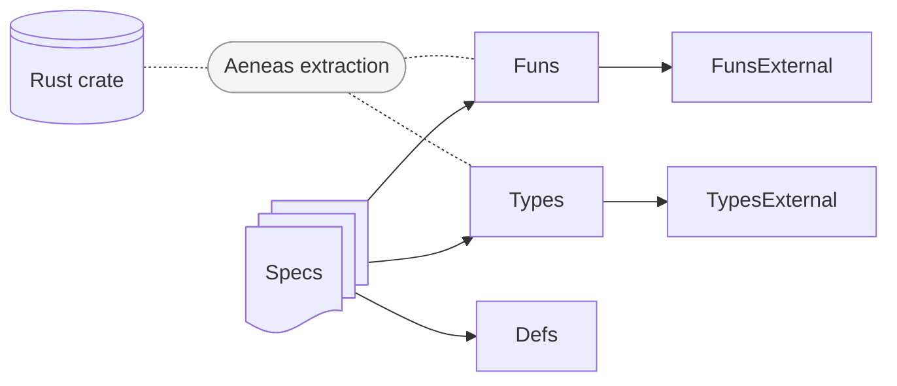

# Diagram Preview

```mermaid
flowchart LR
    A@{ shape: lin-cyl, label: "Rust crate" }
    AE@{ shape: stadium, label: "Aeneas extraction" }

    A -.- AE
    AE -.- B[Funs]
    AE -.- C[Types]

    D[FunsExternal]
    E[TypesExternal]

    B --> D
    C --> E

    G --> B
    G --> C
    G --> F[Defs]

    G@{ shape: docs, label: "Specs" }

    style AE fill:#f5f5f5,stroke:#999
```
