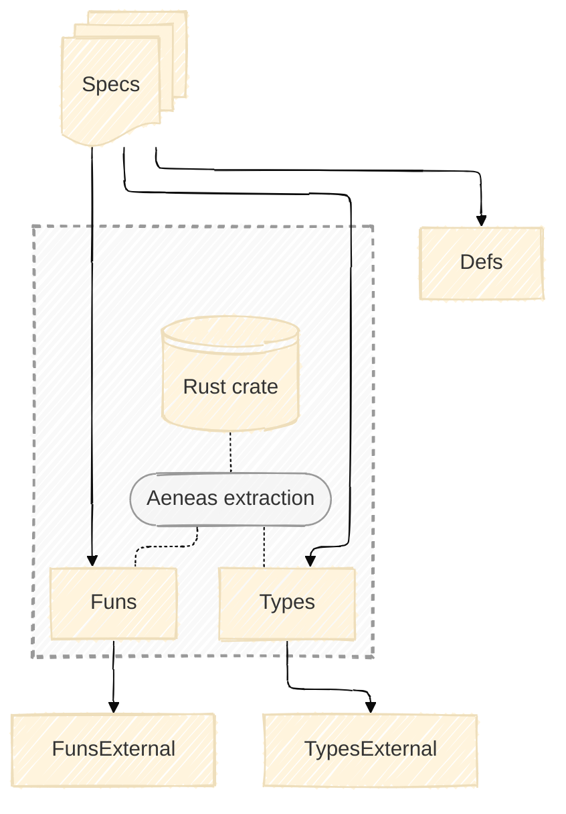

# Diagram Preview

```mermaid
---
config:
  layout: elk
  look: handDrawn
  theme: base
---
flowchart TD
    subgraph extraction [" "]
        direction TB
        A@{ shape: lin-cyl, label: "Rust crate" }
        AE@{ shape: stadium, label: "Aeneas extraction" }
        B[Funs]
        C[Types]

        A -.- AE
        AE -.- B
        AE -.- C
    end

    D[FunsExternal]
    E[TypesExternal]
    F[Defs]
    G@{ shape: docs, label: "Specs" }

    B --> D
    C --> E

    G --> B
    G --> C
    G --> F

    style AE fill:#f5f5f5,stroke:#999
    style extraction fill:#f9f9f9,stroke:#999,stroke-width:2px,stroke-dasharray: 5 5
```
